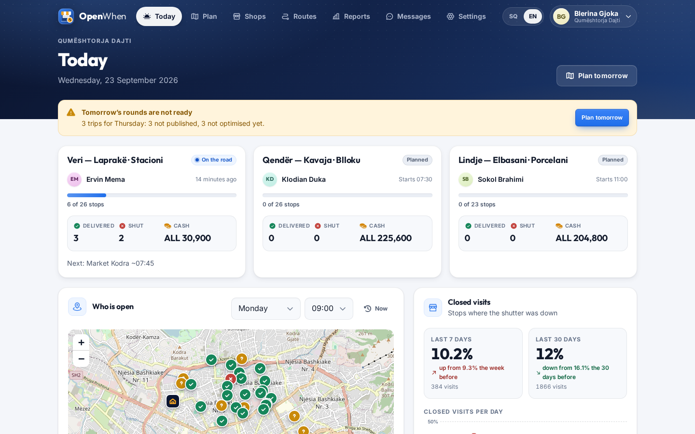
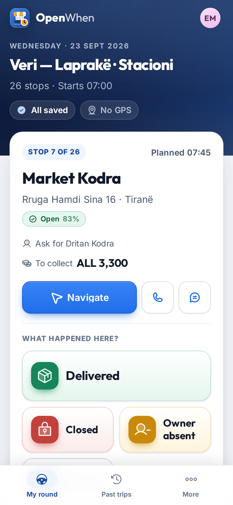
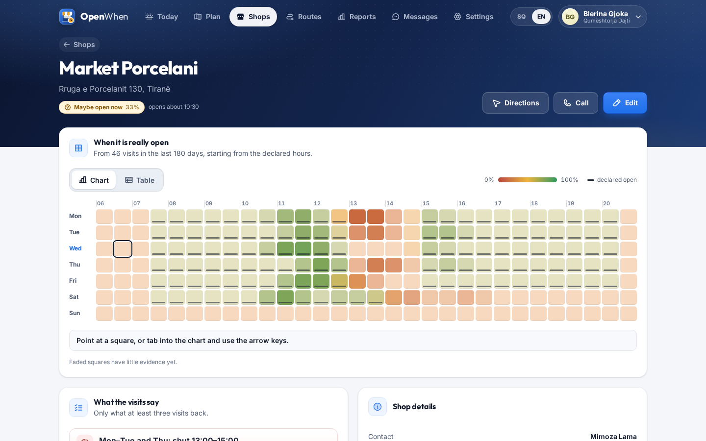
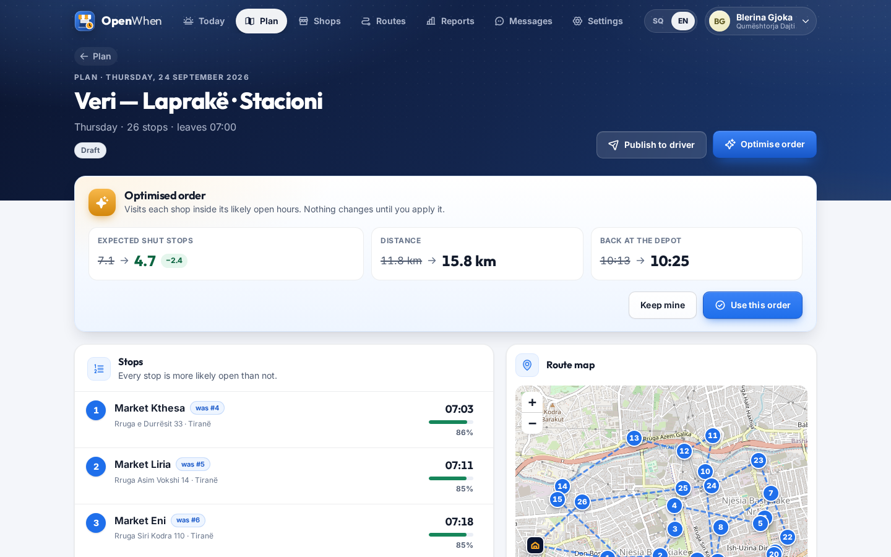
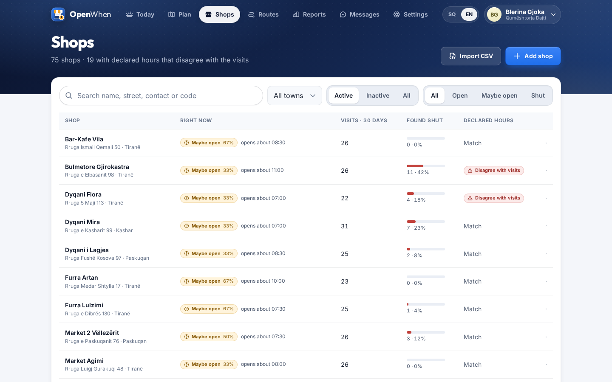
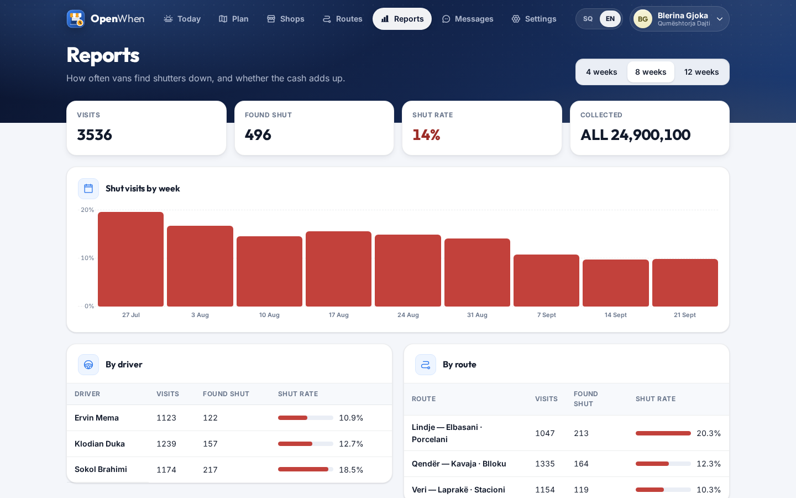
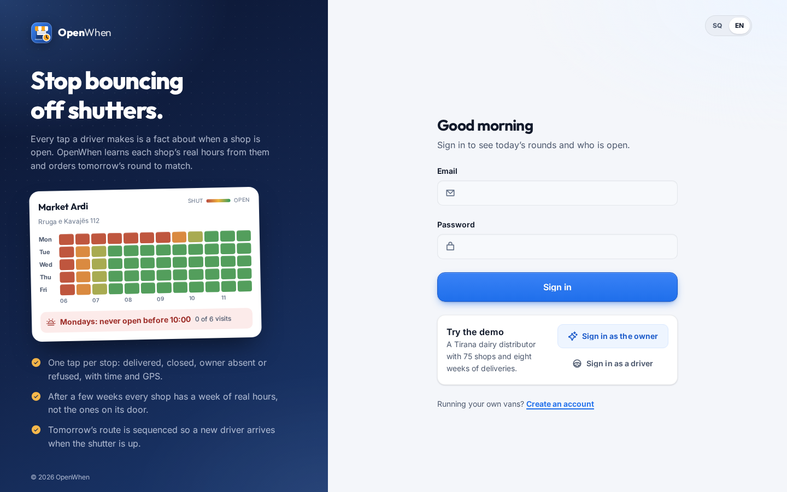
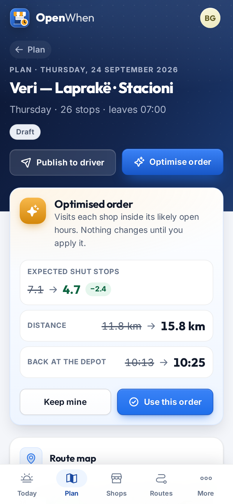

# OpenWhen

The driver app for micro-distributors that learns when every shop is actually open. One tap per stop, and within weeks tomorrow's route is sequenced to reach each shop inside its real opening window, so a new driver stops bouncing off shutters on day one.

<p>
  
  
</p>

## Why

Opening hours on Google or on the door of a small shop are set once, or never, and drift: lunch closures, Friday prayer, market day, the owner at the bank. The people who know when shop 37 is really open are the distributor's drivers, and that knowledge lives in their heads. When a driver leaves, the replacement spends weeks finding shutters down; "closed, come back later" is 10–20% of stops on dense informal-retail routes. Nobody records the outcome of a visit with its time, so nobody can work out when a shop is open, and route optimisers take time windows as input without ever learning them.

OpenWhen makes the tap the driver needs anyway (delivered, with the cash collected) the thing that records the shop's hours.

## What it does

**For the driver (phone first, works offline)**
- Today's round in order, with the next stop large: address, notes left by other drivers, who to ask for, the amount to collect, one tap to navigate, call or WhatsApp the shop.
- Four big outcome buttons: *Delivered* (cash collected, optional photo of the signed note), *Closed*, *Owner absent*, *Refused*. Time and GPS are added automatically; a stop can be skipped, corrected, or visited again after lunch.
- Offline first: every tap is stored on the phone (IndexedDB) with its own UUID and sent in order when there is signal. A chip shows *All saved*, *3 waiting to sync*, *Offline* or taps the office refused.
- End of round: counts per outcome, cash expected against collected, shortfalls, and the shops found shut.

**For the owner and dispatcher**
- **Today**: each van's progress, shut stops and cash; the share of visits that found the shutter down over 7 and 30 days with the trend; the shops found shut most often; the shops whose declared hours the visits contradict.
- **Who is open**: every shop on an OpenStreetMap map, coloured by its chance of being open now or at any weekday and time, with a shape inside each pin (tick, question mark, cross) so colour is never the only signal.
- **Shops**: search, town and "open now" filters; a weekday × half-hour **heatmap** of learned opening hours (keyboard navigable, values on hover and focus, and a table view); learned rules in plain sentences ("Mondays: never open before 10:00, 0 of 5 visits found it open"); declared hours next to what the visits show; visit history with GPS distance and proof photos; the raw observation log; editing of details, location (map picker) and declared hours.
- **CSV import** of the customer list and of visit history from before OpenWhen: upload, a preview with every row's errors, then confirm. English or Albanian headers, comma, semicolon or tab separated.
- **Routes**: standing rounds with weekdays, usual driver, start time and ordered shops.
- **Plan** (any date): generate the day's trips from the routes, open a trip to see every stop's arrival time, chance of being open and warnings ("Arrives 08:40, opens around 10:00"), **optimise** the order with a before/after comparison (expected shut stops, distance, time back at the depot), reorder by hand, assign the driver and publish.
- **Reports**: shut-visit rate by week, driver and route; cash reconciliation per trip.
- **Ask the shop**: when the declared hours disagree, send the shop a WhatsApp message asking for its real hours (through the outbox, in the distributor's language).
- English and Albanian throughout; roles Owner, Dispatcher and Driver, with join links for the team.

## How it works

**Every tap is an observation.** *Delivered*, *Refused* and *Owner absent* mean someone was behind the counter, so the shop was open; *Closed* means it was shut; a skipped stop says nothing. The phone's time of the tap (checked against the server's clock) is stored with the weekday and minute in the distributor's time zone.

**The opening-hours model.** Each shop has a grid of 7 weekdays × 30 half-hours from 06:00 to 21:00. Every cell is a Beta(α, β) belief about "the shutter is up". It starts from the declared hours (declared open 2:1, declared closed 1:2, unknown 1:1), so a shop with no history behaves as it says. Each observation adds 1 to its own cell and 0.5 to the cell on either side, to α when open and to β when shut. P(open) = α / (α + β), and the evidence behind a cell (the sum of weights) is shown by how strongly the heatmap colours it. The last 180 days count, so a shop that changed its hours is not held to its old ones.

**Rules.** For each weekday the model finds the first and last *reliably open* half-hour (P ≥ 0.7) and the gaps between them (P < 0.5). Each becomes a rule only if the visits inside its window back it: at least three of them, at most one in five open. Days whose windows are within half an hour are merged, keeping the more cautious boundary. "Shut all day" needs visits spread over at least four hours, not three calls at lunchtime. The same rules drive the *declared against observed* check.

**Route sequencing.** Travel time is the straight-line distance × 1.3 at 25 km/h plus six minutes at each stop, from the depot and back. An order costs its travel minutes plus 30 minutes for every expected shut stop, Σ(1 − P(open at the arrival time)). The optimiser starts from nearest neighbour (and from the dispatcher's own order), improves both with 2-opt reversals and single-stop moves until nothing helps, and keeps the cheaper result. It is deterministic and never worse than the order you already have.

**Sync.** The server treats a tap's UUID as its identity, so sending the same tap twice changes nothing. A new tap on a done stop is a correction (it replaces the wrong observation) unless the driver marks it as a second visit, which keeps both. Cash expected is what the delivered stops owed; collected is what the driver typed in.

## Stack

- Backend: Laravel 12 (PHP 8.2), PostgreSQL, Sanctum SPA session cookies, PHPUnit.
- Frontend: Vue 3.5, Vite, TypeScript, Pinia, vue-i18n, Leaflet with OpenStreetMap tiles, Phosphor icons, installable PWA, Vitest.
- Messaging: WhatsApp Cloud API through an outbox; without an account messages stay in the outbox with an "Open in WhatsApp" link.

## Run it locally

Prerequisites: PHP 8.2 with `pdo_pgsql`, Composer, Node 22, PostgreSQL 14 or newer.

```bash
# 1. Databases
psql -U postgres -c "CREATE ROLE openwhen LOGIN PASSWORD 'openwhen' CREATEDB"
psql -U postgres -c "CREATE DATABASE openwhen OWNER openwhen"
psql -U postgres -c "CREATE DATABASE openwhen_test OWNER openwhen"

# 2. Backend (http://127.0.0.1:8114)
cd backend
composer install
cp .env.example .env
php artisan key:generate
php artisan migrate --seed        # demo distributor with 8 weeks of deliveries
php artisan serve --port=8114

# 3. Frontend (http://localhost:5114), in a second terminal
cd frontend
npm install
BACKEND_URL=http://127.0.0.1:8114 PORT=5114 npm run dev
```

Demo accounts (password `demo1234`): owner `demo@openwhen.test`, dispatcher `dispatcher@openwhen.test`, drivers `driver1@openwhen.test`, `driver2@openwhen.test`, `driver3@openwhen.test`. The demo is *Qumështorja Dajti*, a Tirana dairy distributor with 75 shops, three rounds and eight weeks of deliveries drawn from each shop's hidden real hours; the last two weeks were optimised, and tomorrow's trips are waiting to be planned.

For production, build the frontend (`npm run build`) and serve the contents of `frontend/dist` from `backend/public`; every non-API path falls back to `index.html`.

## Configuration

Set in `backend/.env`:

| Variable | Default | Purpose |
| --- | --- | --- |
| `DB_DATABASE`, `DB_USERNAME`, `DB_PASSWORD` | `openwhen` | PostgreSQL connection |
| `APP_PUBLIC_URL` | `http://localhost:5114` | Base URL of the web app, used in join links |
| `APP_DEMO` | `true` | Seeds the demo distributor and enables the reply simulator |
| `APP_DEFAULT_LOCALE`, `APP_DEFAULT_TIMEZONE` | `sq`, `Europe/Tirane` | For new companies |
| `MESSAGING_DRIVER` | `log` | `log` keeps messages in the outbox; `whatsapp` sends them |
| `WHATSAPP_TOKEN`, `WHATSAPP_PHONE_NUMBER_ID`, `WHATSAPP_APP_SECRET`, `WHATSAPP_VERIFY_TOKEN` | empty | WhatsApp Cloud API; the webhook is `/api/webhooks/whatsapp` |
| `ANTHROPIC_API_KEY` | empty | Not used by OpenWhen; nothing depends on it |

Without WhatsApp credentials every message is still written to the outbox (Messages) and can be sent from the dispatcher's own phone with the "Open in WhatsApp" link. The depot (start and end of every route) is set under Settings.

## Tests

```bash
cd backend && php artisan test      # 85 tests: model, rules, optimiser, API flows, tenant isolation, imports
cd frontend && npm run type-check && npm test && npm run build-only
```

The unit tests cover the Beta posterior and its neighbour weighting, rule extraction thresholds and merging, the declared/observed comparison, and the optimiser (improves on nearest neighbour, respects the start time, deterministic, never worse than the current order). Feature tests cover outcome sync idempotency (the same UUID twice), corrections and second visits, drivers seeing only their own published trips, tenant isolation, trip generation, optimising and publishing, CSV import validation and reports. The frontend tests cover the offline outbox, rule sentences, heatmap colours, the end-of-round summary and Albanian formatting.

## Project structure

```
backend/
  app/Hours/          opening-hours model, rules, declared vs observed, "open now"
  app/Routing/        route optimiser (pure) and geography
  app/Trips/          trip planner, generator from routes, outcome recorder, summary
  app/Imports/        CSV reading and the shop and visit-history importers
  app/Reports/        shut-visit rates and cash reconciliation
  app/Http/           controllers, requests, role middleware
  database/seeders/   the demo distributor and its visit simulator
  tests/              Unit (model, rules, optimiser) and Feature (API) tests
frontend/src/
  views/              dashboard, plan, shops, routes, driver, reports, settings, messages
  components/         hours (heatmap, rules, hours editor), map, driver, dashboard, ui
  lib/                hours sentences, offline outbox, IndexedDB store, formatting
  stores/             signed-in user and the driver's offline round
docs/screenshots/     the images in this README
```

<p>
  
  
</p>
<p>
  
  
</p>
<p>
  
  
</p>

## License

MIT, see [LICENSE](LICENSE).
